# 🎬 Cinespoilers API
## **Integrantes**
- Eduardo Quiquia

## 📖 Descripción general
**Cinespoilers API** es una solución backend enfocada en la administración de películas dentro de un sistema de cine.

Permite registrar, consultar, actualizar y eliminar películas mediante endpoints REST. También permite registrar géneros cinematográficos como acción, drama, terror o comedia, y asociarlos a una o varias películas.

El proyecto utiliza **Django REST Framework**, lo que facilita la creación de una API limpia, ordenada y fácil de probar desde el navegador.

## 🎯 Objetivos del proyecto

Los principales objetivos de este proyecto son:

- Desarrollar una API REST funcional usando Django y Django REST Framework.
- Aplicar operaciones CRUD sobre películas.
- Crear una entidad `Genre` para administrar géneros.
- Relacionar `Movie` y `Genre` mediante una relación muchos a muchos.
- Utilizar serializers para transformar datos entre objetos Python y JSON.
- Gestionar datos desde el panel administrativo de Django.
- Probar los endpoints desde la Browsable API.
- Mantener una base simple y ordenada para futuras mejoras.

## ⚙️ Funcionalidades principales
Actualmente, el sistema permite:

- CRUD de movies
- CRUD de genres

## 🚀 Tecnologías utilizadas
Este proyecto fue desarrollado con las siguientes tecnologías:

- Python
- Django
- Django REST Framework
- SQLite
- Git
- GitHub

## **🖼️ Evidencias** 
## 1. Primera evidencia (Preparación de entorno)
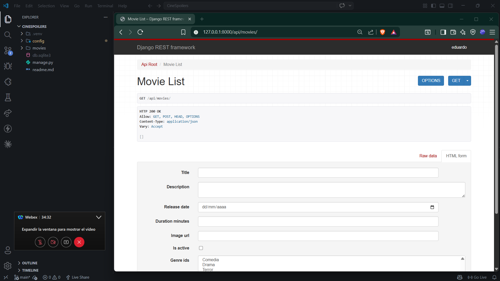

## 2. Creando movie desde Admin
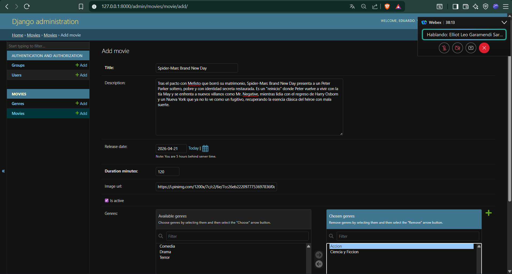
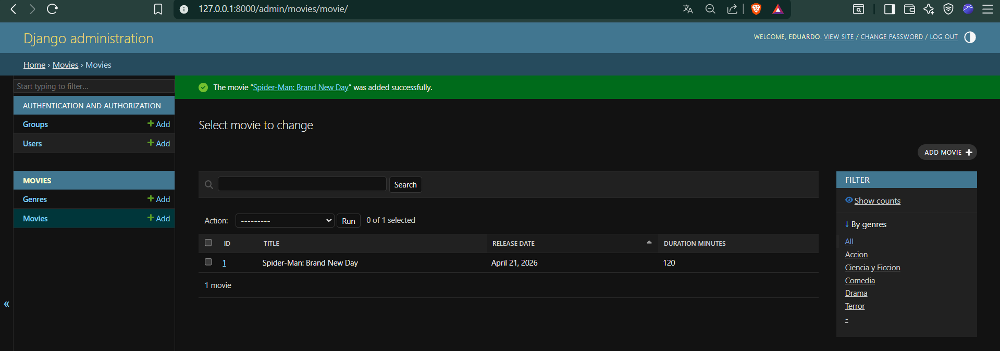

## 3. Obteniendo pelicula sin relacion con genres
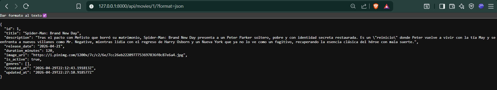

## 4. Agregando genres a movie desde admin
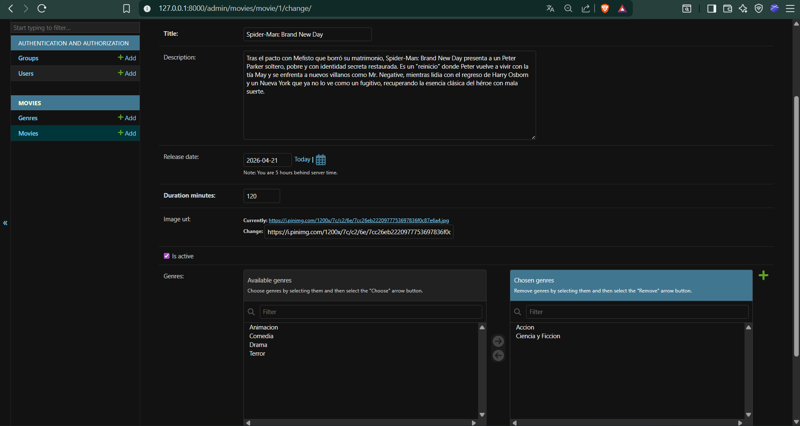

## 5. Obteniendo pelicula con relacion de generos
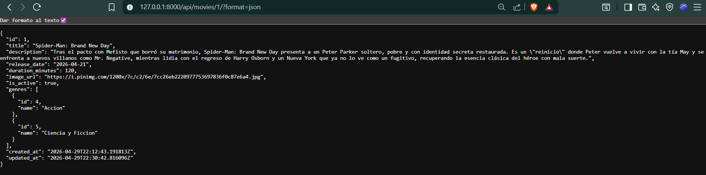

## 4. Obteniendo peliculas en front
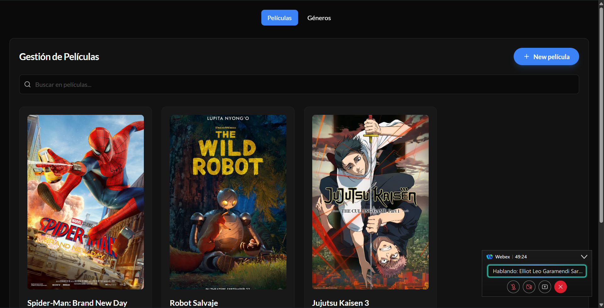

## 5. Obteniendo generos en formato json
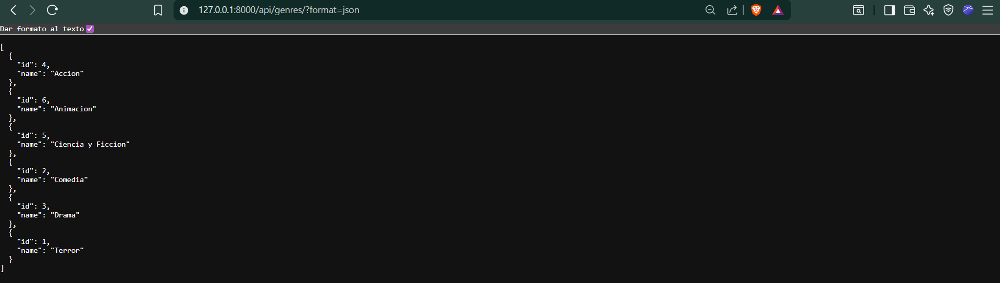

## 6. Obteniendo generos en front
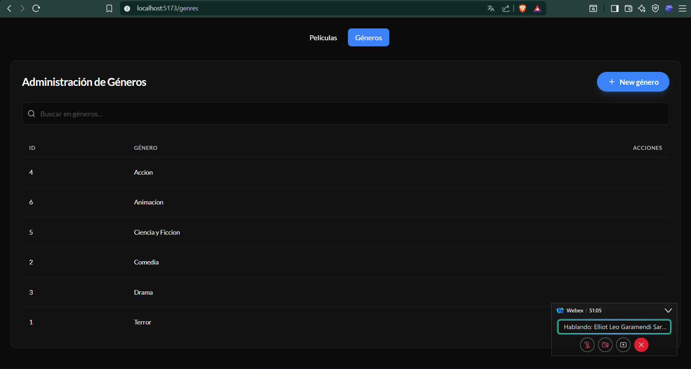

## 7. Agregando app actors
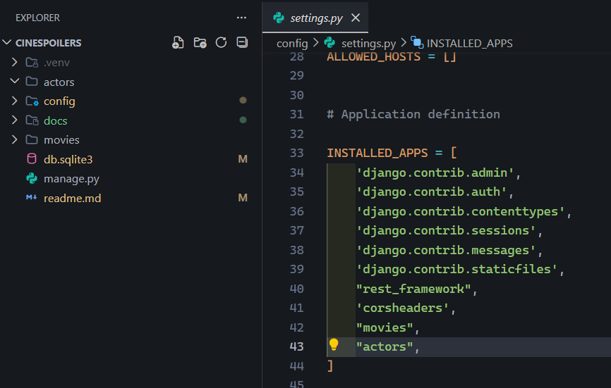

## 8. Obteniendo actor en formato json
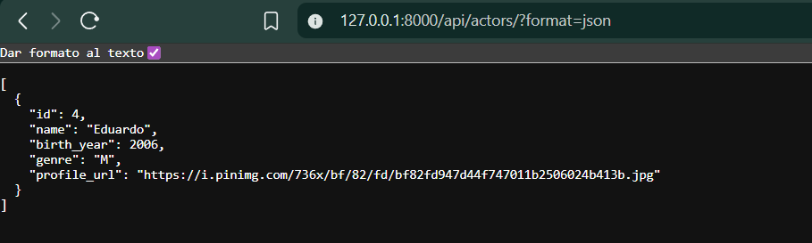

## 8. Creando Actors desde Admin
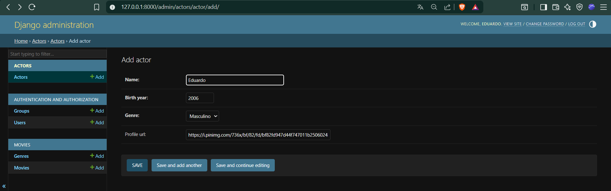

## 9. Obteniendo actor en front
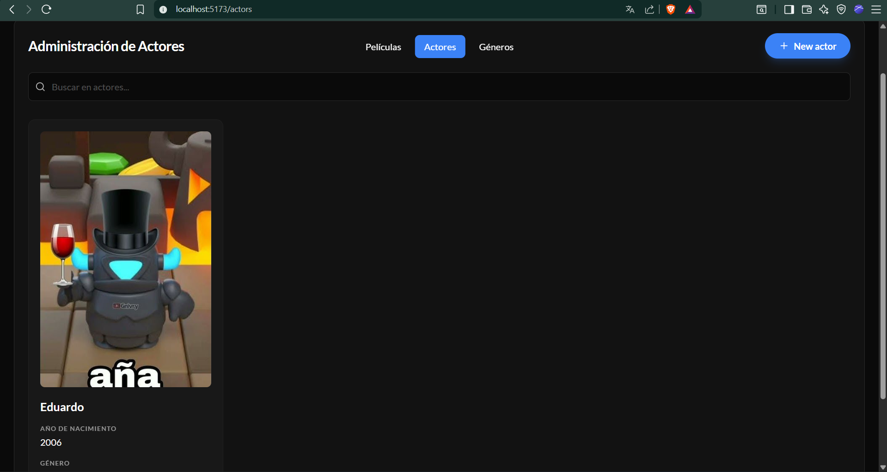
